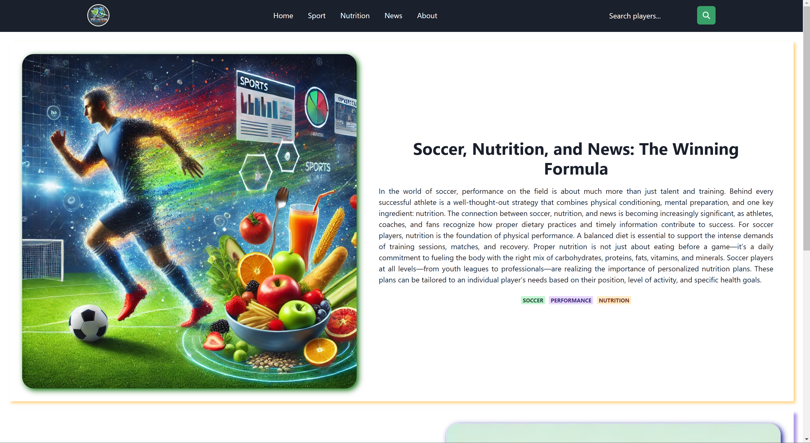

# Soccer Nutrition and News

### 📋 Overview

*Soccer Nutrition and News* is an interactive platform that allows users to search for football players based on league,
team, and season, providing details such as weight, height, and other essential information about players. The platform
includes general nutrition tips and healthy recipes useful for any athlete, along with a form where users can put
their own nutritious recipes. Additionally, the platform features a slideshow with updated sports news and a form where
users can put their own news.

### 🚀 Features

- **Advanced Football Player Search**: Find players by league, team, and season, displaying details like weight, height,
  and other relevant statistics.
- **Nutrition Tips and Recipes**: General nutrition recommendations and healthy recipes suitable for any athlete, plus a
  form for users to put their own recipes.
- **Sports News**: Slideshow with the latest sports news, along with a form where users can put their own news.

### 🛠️ Tech Stack

- **Frontend**: React, Chakra UI for styling, Formik & Yup for form handling.

**APIs Used**:

- [News API](https://newsapi.org)
- [Soccer API](https://rapidapi.com/api-sports/api/api-football/playground/)
- [Nutrition API](https://spoonacular-recipe-food-nutrition-v1.p.rapidapi.com/recipes/)

### 📸 Screenshots

#### Home Page


#### Player and Teams Search


#### Nutrition Tips


#### Sports News


#### About Page




### 📦 Installation & Setup

1. Clone the repository:
   ```bash
   git clone https://github.com/claudiu28/Soccer-Nutrition-and-News.git
   cd Soccer-Nutrition-and-News
   ```

2. Install dependencies:
    ```bash
    npm install
    ```

3. Run app:

   ```bash
   npm run dev
   ```